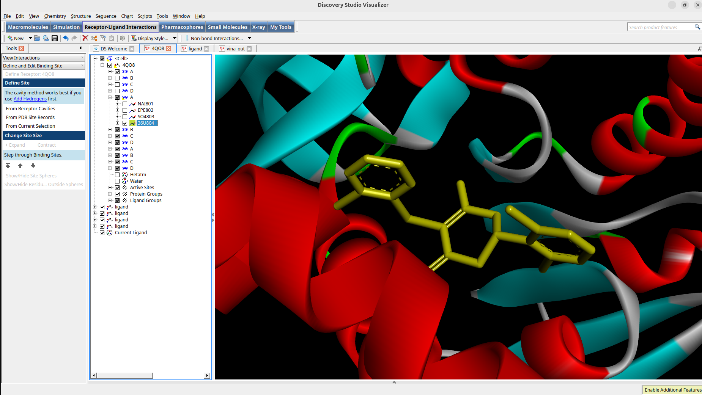
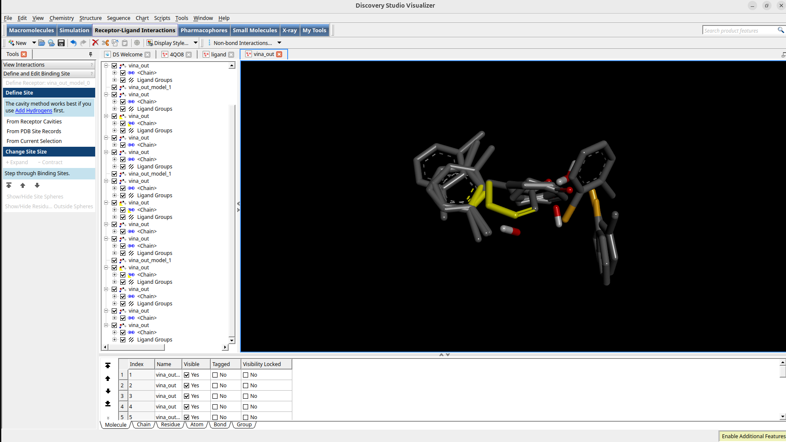
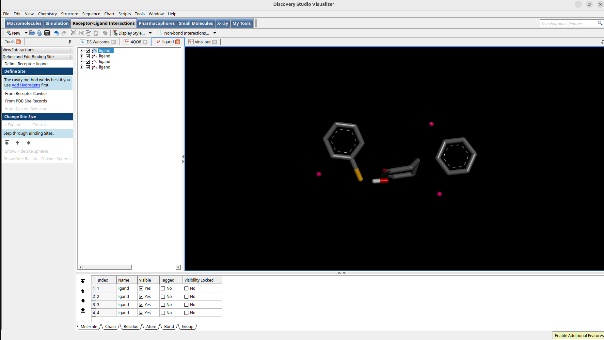

# 🧬 Molecular Docking of 36U against 4QO8 using AutoDock Vina

> **Target:** 4QO8 — Cancer-associated protein  
> **Ligand:** 36U — (5S)-2-[(2-chlorophenyl)sulfanyl]-5-(2,6-dichlorophenyl)-3-hydroxycyclohex-2-en-1-one  
---
## 🎯 Biological Context

**4QO8 — Lactate Dehydrogenase A (LDHA)**

LDHA catalyzes the conversion of pyruvate to lactate, the final step of glycolysis. Many cancer cells rely heavily on glycolysis even in the presence of oxygen (the "Warburg effect"), producing excess lactate that supports rapid tumor growth, survival under hypoxic conditions, and immune evasion. Because of this metabolic dependency, LDHA is over-expressed and over-active in many cancers, making it a validated therapeutic target.

The PDB structure 4QO8 captures human LDHA bound to a substituted 3-hydroxy-2-mercaptocyclohex-2-enone inhibitor (compound 104), originally identified via screening (IC50 = 1.7 μM) and optimized to IC50 = 0.18 μM, with favorable oral pharmacokinetics in rat studies (F = 45%).

**Ligand 36U** is structurally related to this inhibitor class — this docking study evaluates how well 36U binds the LDHA active site, as a step toward identifying potential LDHA inhibitors that could disrupt cancer cell metabolism.
---
. Because of this, LDHA is over-expressed/over-active in many cancers and is a recognized drug target. The structure shows LDHA in complex with a compound that inhibits the enzyme, originally identified through screening and optimized to improve biochemical inhibition activity, with promising pharmacokinetic properties when tested orally in rats. RCSB PDB
So your docking is essentially screening/testing how well your ligand binds LDHA's active site — the idea being that a strong inhibitor could block cancer cells' altered metabolism
> **Tool:** AutoDock Vina v1.2.5  
> **Visualisation:** BIOVIA Discovery Studio Visualizer 2025 & PyMOL 3.2

---

## 📁 Project Structure

```
cancer/
├── 4QO8.pdb                  # Original receptor (PDB)
├── 4QO8_fixed.pdb            # Repaired receptor (PDBFixer)
├── receptor.pdbqt            # Prepared receptor for docking
├── 36U_ideal.sdf             # Ligand (SDF format)
├── 36U_rdkit.sdf             # Ligand optimized via RDKit
├── ligand_final.pdbqt        # Prepared ligand for docking
├── config.txt                # Vina configuration file
├── vina_out.pdbqt            # Docking output (all poses)
├── vina.log                  # Docking log
├── active_site_finder.py     # Active site detection script
└── fix_protein.py            # Protein repair script
```

---

## ⚙️ Workflow

### 1. Protein Preparation
```bash
# Repair missing atoms and add hydrogens at pH 7.4
python3 fix_protein.py
```
Uses **PDBFixer + OpenMM** to:
- Find and repair missing residues
- Add missing heavy atoms
- Add hydrogens at physiological pH (7.4)

---

### 2. Active Site Detection
```bash
python3 active_site_finder.py 4QO8.pdb
# Select ligand: 36U (chain A)
```
## 🖼️ Visualizations

### 4QO8 with 36U Ligand in Active Site



**Active Site Coordinates:**
| Parameter | Value |
|-----------|-------|
| center_x  | 40.091 Å |
| center_y  | 16.520 Å |
| center_z  | 48.891 Å |

---

### 3. Ligand Preparation
```bash
# Optimize geometry with RDKit
python3 -c "
from rdkit import Chem
from rdkit.Chem import AllChem
mol = Chem.MolFromMolFile('36U_fresh.sdf', removeHs=False)
mol = Chem.AddHs(mol)
AllChem.EmbedMolecule(mol, AllChem.ETKDG())
AllChem.MMFFOptimizeMolecule(mol)
Chem.MolToMolFile(mol, '36U_rdkit.sdf')
"

# Convert to PDBQT with Gasteiger charges
obabel 36U_rdkit.sdf -O ligand_final.pdbqt --partialcharge gasteiger
```

---

### 4. Docking Configuration
```ini
# config.txt
receptor = receptor.pdbqt
ligand = ligand_final.pdbqt
center_x = 40.618
center_y = 17.888
center_z = 38.467
size_x = 15
size_y = 18
size_z = 15
exhaustiveness = 8
num_modes = 9
energy_range = 4
```

---

### 5. Running AutoDock Vina
```bash
vina --config config.txt --out vina_out.pdbqt 2>&1 | tee vina.log
```

---

## 📊 Results
### Ligand Docking Poses


### Vina Output - All Binding Modes

Docking produced **9 binding poses** visualized in Discovery Studio Visualizer.  
The best pose (mode 1) shows 36U occupying the active site with favorable interactions.

To view results in PyMOL:
```python
load 4QO8_fixed.pdb
load vina_out.pdbqt
hide everything
show cartoon, 4QO8_fixed
show sticks, vina_out
select best_pose, vina_out and state 1
zoom best_pose
```

---

## 🛠️ Environment & Tools

| Tool | Version |
|------|---------|
| AutoDock Vina | 1.2.5 |
| OpenBabel | 3.1.1 |
| RDKit | 2024.09.3 |
| PDBFixer | 1.12.0 |
| OpenMM | 8.5.2 |
| PyMOL | 3.2.0 |
| BIOVIA Discovery Studio | 2025 |
| Python | 3.10 |
| OS | Ubuntu 24.04 |

---

## 📚 References

- Trott O, Olson AJ. *AutoDock Vina: improving the speed and accuracy of docking.* J Comput Chem. 2010;31(2):455-461. DOI: [10.1002/jcc.21334](https://doi.org/10.1002/jcc.21334)
- Berman HM et al. *The Protein Data Bank.* Nucleic Acids Res. 2000;28:235-242.
- PDB Structure: [4QO8](https://www.rcsb.org/structure/4QO8)
- Ligand: [36U](https://www.rcsb.org/ligand/36U)

---

## 👨‍🔬 Author

**Oigara Tinega**  
AI Engineer & Computational Chemist  
📧 tinegachris797@gmail.com  
🌐 [Portfolio](https://portfolio-pi-pink-8zvm423hp8.vercel.app/)  
💻 [GitHub](https://github.com/tinegachris-o)
